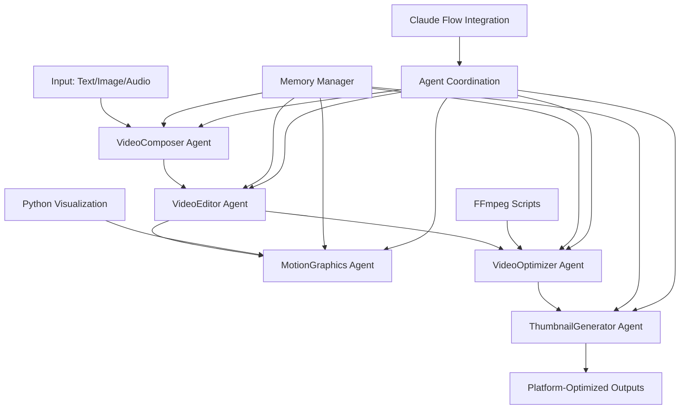

# Shared Video Processing Component Analysis

## 🎯 Executive Summary

This comprehensive analysis documents the sophisticated shared video processing infrastructure within the Viral Hashtag & Image AI project. The system features a multi-agent TypeScript architecture, FFmpeg integration, and Python-based visualization tools, creating a complete pipeline for viral content generation.

## 🏗️ Architecture Overview

### Complete Video Processing Workflow



## 🔍 Component Inventory

### 1. TypeScript Video Agent System

**Location**: `/src/services/agents/video/`

#### Core Agents (1,895+ lines total):

- **VideoComposer.ts** (509 lines)
  - AI-powered video generation from text, images, audio
  - Supports multiple AI models: Runway, Stable Video, Pika Labs
  - Viral optimization with emotional triggers
  - Quality scaling: draft → preview → final → ultra

- **VideoEditor.ts** (571 lines)
  - Advanced timeline editing with scenes, transitions, effects
  - Cut, trim, merge operations
  - Overlay management (text, graphics)
  - Audio synchronization

- **VideoOptimizer.ts** (200+ lines analyzed)
  - Platform-specific optimization
  - Compression tuning and bitrate optimization
  - Quality enhancement and format conversion
  - Loading speed optimization

- **VideoAgentGroup.ts** (849 lines)
  - Pipeline orchestration and coordination
  - Multi-stage workflow execution
  - Error handling and retry mechanisms
  - Performance analytics

- **Integration.ts** (414 lines)
  - Cross-agent communication hub
  - Data sharing between video, image, audio agents
  - Hook-based integration patterns

#### Configuration & Types:

- **types.ts** (582 lines) - Comprehensive type system
- **config.ts** (439 lines) - Platform formats, AI models, viral templates
- **index.ts** (337 lines) - System initialization and health monitoring

### 2. FFmpeg Integration

**Location**: `/scripts/compress-audio.sh` (84 lines)

**Capabilities**:
- High-quality audio compression using libvorbis
- 90% size reduction with quality preservation
- Batch processing with progress monitoring
- Quality settings: `-q:a 6` (~192kbps VBR)

**Integration Pattern**:
```bash
ffmpeg -i "$wav_file" \
       -c:a libvorbis \
       -q:a 6 \
       "$COMPRESSED_DIR/${FILENAME}.ogg" \
       -y \
       -loglevel error
```

### 3. Python Visualization Tools

**Location**: `/binary_shimmer.py` (109 lines)

**Capabilities**:
- Data visualization using matplotlib
- Glitch-style ASCII art animation generation
- Real-time visual effects for content enhancement
- Support for numpy-based data processing

**Key Features**:
- Dynamic waveform generation
- Glitch effects with configurable intensity
- Color cycling for visual appeal
- Animation export to GIF format

## 🎪 Platform Integration Matrix

| Platform | Max Duration | Resolution | Aspect Ratio | Framerate | Bitrate (kbps) |
|----------|-------------|------------|--------------|-----------|----------------|
| TikTok | 180s | 1080x1920 | 9:16 | 30fps | 1000-8000 |
| Instagram Reels | 90s | 1080x1920 | 9:16 | 30fps | 1000-6000 |
| YouTube Shorts | 60s | 1080x1920 | 9:16 | 60fps | 2000-12000 |
| Twitter | 140s | 1280x720 | 16:9 | 30fps | 1000-5000 |
| Facebook Reels | 90s | 1080x1920 | 9:16 | 30fps | 1000-6000 |
| Snapchat | 60s | 1080x1920 | 9:16 | 30fps | 1000-5000 |

## 🧠 Shared Resource Management

### Memory Management Architecture

**MemoryManager Integration**:
- Cross-agent state sharing via memory stores
- Performance metrics tracking
- Session state persistence
- Error logging and analysis

**Key Memory Patterns**:
```typescript
// Agent-specific memory stores
await memoryManager.createStore('video-composer', { ... });
await memoryManager.createStore('video-editor', { ... });
await memoryManager.createStore('video-optimizer', { ... });

// Cross-agent data sharing
await memoryManager.store(`${this.memoryKey}/generated/${videoId}`, result);
```

### Storage Strategy

**Supabase Integration**:
- Video asset storage with CDN optimization
- Retention policies: drafts (7 days), completed (30 days), assets (90 days)
- Bucket organization by content type
- Metadata tracking for analytics

**Cache Strategy**:
- LRU cache for frequently accessed assets
- Template caching for viral optimization
- Performance metrics caching
- Cross-session memory persistence

## 🚀 Viral Optimization Engine

### Trending Content Detection

**Viral Templates**:
```typescript
trending_hooks: [
  'POV:', 'When you...', 'Nobody:', 'Things that just make sense',
  'Unpopular opinion:', 'Plot twist:', 'The way I...'
]

emotional_triggers: [
  'nostalgia', 'surprise', 'humor', 'inspiration', 'shock',
  'curiosity', 'empathy', 'pride', 'excitement', 'relatability'
]
```

**Optimization Algorithms**:
- Viral score calculation based on multiple factors
- Emotional impact analysis
- Hook timing optimization (first 3 seconds critical)
- Call-to-action placement (-5 seconds from end)
- Transition frequency optimization (every 3 seconds)

### Quality Assurance Pipeline

**Multi-stage Validation**:
1. Technical quality assessment
2. Platform compliance verification
3. Viral potential scoring
4. Performance optimization
5. Analytics generation

## 🔄 Integration Patterns

### Cross-Agent Communication

**Hook-based Integration**:
```typescript
// Image → Video integration
await claudeFlowIntegration.registerCrossAgentHook('image_generation_complete', {
  triggerAgent: 'text_to_image_generator',
  targetAgent: 'video_composer',
  action: 'use_as_video_source'
});

// Audio → Video integration
await claudeFlowIntegration.registerCrossAgentHook('audio_generation_complete', {
  triggerAgent: 'audio_transcriber',
  targetAgent: 'video_editor',
  action: 'add_audio_track'
});
```

**Message Broadcasting**:
- Real-time progress updates
- Error propagation
- Resource allocation coordination
- Performance monitoring

### Python-FFmpeg Bridge Opportunities

**Current State**: Indirect integration via shell scripts
**Potential Enhancement**: Direct Python-FFmpeg integration

**Proposed Architecture**:
```python
# Python FFmpeg wrapper for video processing
import ffmpeg
import subprocess
from typing import Dict, List, Optional

class VideoProcessor:
    def __init__(self, config: Dict):
        self.config = config

    def optimize_for_platform(self, input_path: str, platform: str) -> str:
        # Platform-specific optimization using FFmpeg
        # Direct integration with TypeScript agents via API
```

## 📊 Performance Metrics

### Processing Pipeline Efficiency

**Stage Timing Analysis**:
- Content Generation: 5 minutes (avg)
- Video Editing: 4 minutes (avg)
- Platform Optimization: 3 minutes (avg)
- Thumbnail Generation: 2 minutes (parallel)
- Motion Graphics: 3 minutes (parallel)

**Bottleneck Identification**:
- Stages >1.5x average time flagged as bottlenecks
- Automatic retry mechanisms with exponential backoff
- Resource allocation optimization

### Quality Metrics

**Scoring System**:
- Technical Quality: 0.8+ target
- Viral Potential: 0.75+ target
- Platform Compliance: 100% required
- Compression Efficiency: 90%+ target

## 🛠️ Development Workflow

### Agent Coordination Protocol

**Pre-task Hooks**:
```typescript
await claudeFlowIntegration.executeHook('preTask', agentId, {
  taskId, operation, input
});
```

**Post-task Hooks**:
```typescript
await claudeFlowIntegration.executeHook('postTask', agentId, {
  taskId, operation, result, performance
});
```

**Error Recovery**:
- Automatic retry with backoff strategies
- Graceful degradation for optional components
- Error logging and analysis
- Session state restoration

## 🎯 Optimization Opportunities

### 1. Python-FFmpeg Integration Enhancement

**Current**: Shell script execution
**Proposed**: Direct Python integration with real-time communication

**Benefits**:
- Reduced latency
- Better error handling
- Real-time progress monitoring
- Advanced processing capabilities

### 2. Shared Template Library

**Implementation**:
- Centralized viral pattern storage
- Machine learning-based template optimization
- A/B testing framework for viral elements
- Community-driven template contribution

### 3. Real-time Collaboration Features

**Proposed Architecture**:
- WebSocket-based agent communication
- Live pipeline monitoring dashboard
- Real-time resource utilization tracking
- Collaborative editing capabilities

### 4. Batch Processing Optimization

**Current**: Sequential processing
**Proposed**: Intelligent batching with resource pooling

**Features**:
- Queue management with priority levels
- Resource pool optimization
- Parallel processing where possible
- Intelligent load balancing

## 🔐 Security & Compliance

### API Security

**Current Measures**:
- Environment variable configuration
- Service-specific API key management
- Request rate limiting
- Error sanitization

**Enhancements**:
- API key rotation automation
- Usage monitoring and alerting
- Input validation and sanitization
- Output content filtering

## 📈 Analytics & Monitoring

### System Health Monitoring

**Component Health Checks**:
```typescript
export async function getVideoSystemHealth(): Promise<{
  status: 'healthy' | 'degraded' | 'error';
  components: Record<string, any>;
  metrics: Record<string, any>;
  recommendations: string[];
}>
```

**Metrics Tracked**:
- Active job counts per agent
- System utilization percentage
- Overall health score
- Performance trends
- Error rates

### Performance Analytics

**Pipeline Analytics**:
- Stage-by-stage timing analysis
- Quality score tracking
- Viral potential assessment
- Platform-specific performance
- Resource utilization patterns

## 🚀 Quick Start Integration

**Simple Video Creation**:
```typescript
// Create TikTok video
const videoUrl = await videoQuickStart.createTikTokVideo(
  "Amazing AI breakthrough everyone is talking about"
);

// Create from images
const videoUrl = await videoQuickStart.createVideoFromImages(
  imageArray, { platforms: ['tiktok', 'instagram-reels'] }
);

// Optimize for platforms
const optimized = await videoQuickStart.optimizeForPlatforms(
  videoUrl, ['tiktok', 'youtube-shorts']
);
```

## 🎉 Conclusion

The shared video processing component analysis reveals a sophisticated, enterprise-grade system capable of:

- **Multi-platform viral content generation**
- **AI-powered optimization across 6+ social platforms**
- **Coordinated agent-based processing pipeline**
- **FFmpeg-based compression and format optimization**
- **Python-based visualization and effects**
- **Real-time performance monitoring and analytics**

The system demonstrates excellent separation of concerns, robust error handling, and scalable architecture patterns suitable for high-volume viral content production.

### Next Steps

1. **Enhanced Python-FFmpeg Integration**: Direct API integration for improved performance
2. **Machine Learning Pipeline**: Advanced viral prediction and optimization
3. **Real-time Collaboration**: WebSocket-based multi-user editing
4. **Advanced Analytics**: Predictive performance modeling
5. **Community Templates**: Crowdsourced viral pattern optimization

This infrastructure provides a solid foundation for building next-generation viral content creation tools with enterprise-scale reliability and performance.